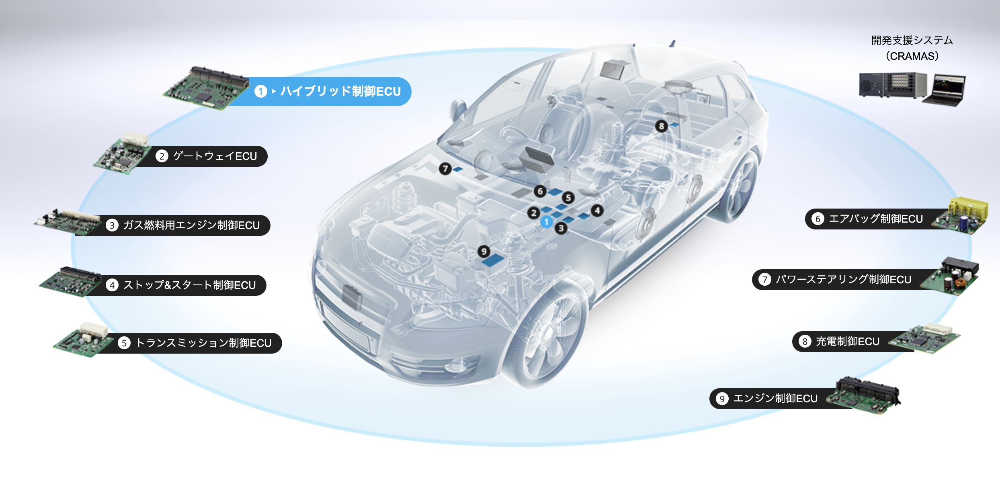
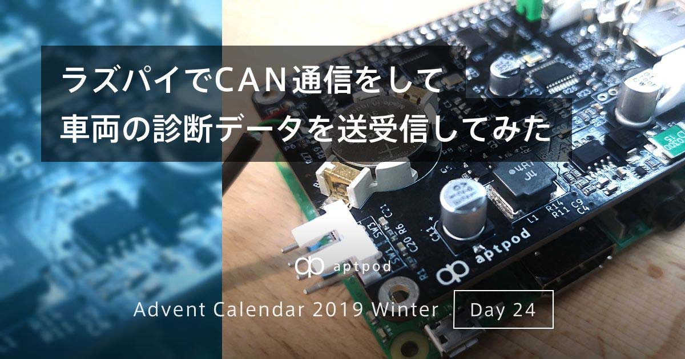
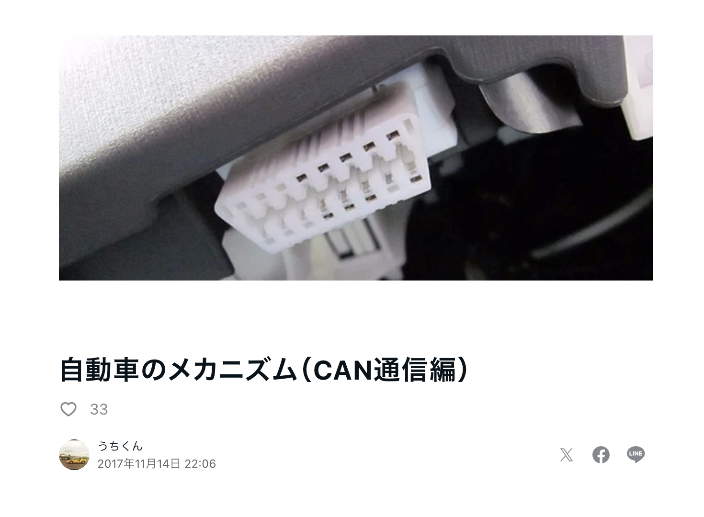
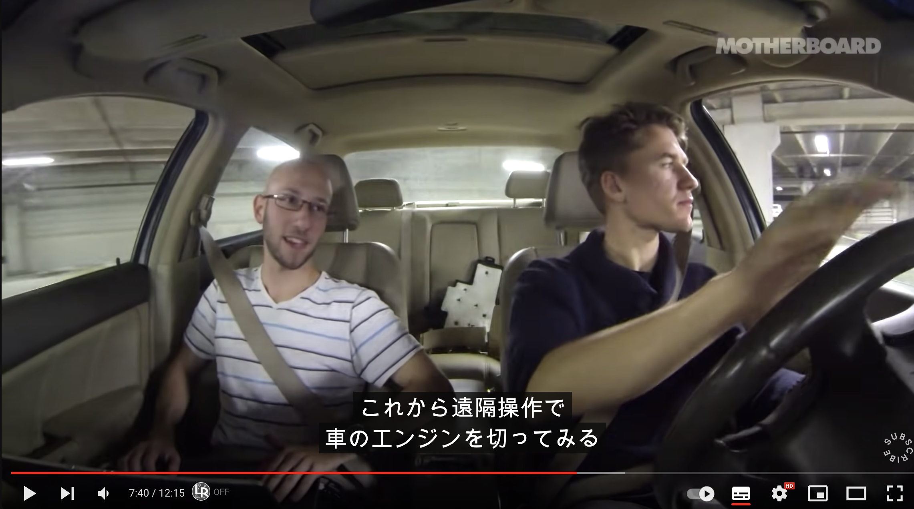
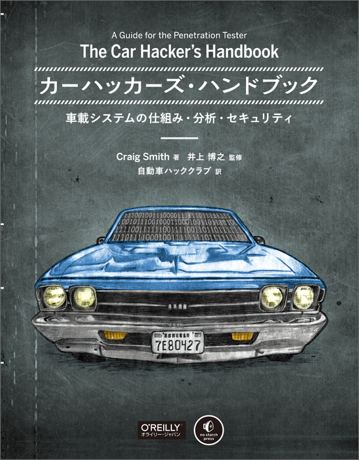
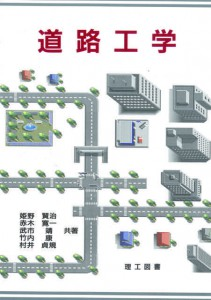

# 車と技術と私
### #えんじょいすべて #ゆるちとせ
## n13u ( @\_n13u\_ )

---

# 自己紹介

## n13u / 西村航

Sapporo Engineer Base 運営事務局・一般社団法人未完事務局などなど
フロントエンドエンジニア
エンジニアとしては、Web系を中心に触ることがほとんどですが、趣味でUnityや3DCG周りも触っています。
  

Twitter [@\_n13u\_](https://twitter.com/_n13u_)

---

# 今日話すこと

「すべて」を楽しもうという話です。技術の話**も**あるよ

---

# みなさん、楽しんでいますか？

---

# 人生楽しんでいますか？

---

# 「すべて」楽しんでいますか？

---

# 「すべて」を楽しむ、とは？

「技術とビジネス」、「手段と目的」といった
1bitでものごと考えられがちですが、、、

---

# 「すべて」を楽しむ、とは？

「技術とビジネス」、「手段と目的」、「理系 / 文系」といった
1bitでものごと考えられがちですが、、、
世の中そんな単純じゃないですし、極論になりがちですよね、、、

---

# 「すべて」を楽しむ、とは？

文字通りを「すべて」を楽しもうという取り組みです

---
# \#えんじょいすべて 

# 「すべて」を楽しむ、とは？

「楽しいことだけして生きる」みたいなの
ありますね。

**「すべて」を楽しめば解決です**

---
# どう、”楽しむ”のか

1. 特定のテーマを決めます
2. とりあえずなんかやってみます（食べる,見る,動かす etc...）
3. 気になったことを調べます
4. 2に戻ります

---

# 最近楽しんでいること：音楽編

- ハウス・テクノをきいています
  - デトロイト・テクノ（Derrick May etc..）
  - ジャーマン・テクノ（KraftWerk etc..）
  - フレンチ・ハウス（Daft Punk）
  - Carl Craig のライブ行ってきました（一昨日）
- 合わせてファンクとかのR&Bを聞いています
  
楽しみ方、音楽には系譜と技術２つ視点があるので楽しみが大きいです

---
# 最近楽しんでいること：音楽編

- 技術的な楽しみ
  - MIDIやDAW経由での音遊び
  - Eurorack などのハードウェアシンセサイザー
    - スーファミをMIDIシンセサイザー化 [https://www.youtube.com/watch?v=5pTRX_USHc4](https://www.youtube.com/watch?v=5pTRX_USHc4)
  - MAX/MSPでの音生成（クリエイティブコーディング的な？）

---

---
# 最近楽しんでいること：読書編

- フィリップ・K・ディックの高い城の男を買いました（積読）
- デカルトの方法序説（9割読みました）
- 銃・病原菌・鉄（読み始めです）

---

# 今日共有したい、楽しみのメインは、、、
---

車

---

# 車について

## 4日前に免許取りました

---

# 車について
- 現時点で180kmくらい走りました
- 高速２回乗ってます
  - さっきめちゃくちゃ煽られました（つらい）
- タイムズカーシェア便利ですね
- 来週21日、旭川行きます

---

# 車の楽しみポイント
- MT免許なので「クラッチとギア」「エンジン回転数」といった技術的な話ができますね
- とりあえず車のスペック表とかカタログ見るの楽しいですね
- 乗るの楽しいですね

---

# 番外編：４日間車を運転してみて
- 周りの車よく見ましょう
- 教習所の先生が言っていること守りましょう
  - クリープ現象で勝手に車は動きます
- 運転ルールを守っている人が「正義」
- やることでしか乗れるようにならないので助手席に乗れる人を載せて練習しましょう
- 運転のしやすさ 

---

# 「車」を楽しむ：技術編
- 車を作る▶スズキのジムニーはどうも構造が単純で組めるらしい
  - 本当！？
- 車の情報を読み取る
  - 今日はこの話をします
- 「道路工学」←知らない概念
  - この話もします

---

# 本題「車と技術と私」

---

# 車の情報を読み取ってみたい

※自分の車をもって自分の責任の範囲でやりましょう
※ぼくはまだやってません

- OBDという車の診断システムで情報を読み取れる！?
- ECU（電子制御ユニット）で車は動いているとのこと
- こいつにCANという共通規格で接続し、車を動かせるらしい！？
  - ボッシュ社がつくった共通規格でこれがないときは直接ECUにつないでやりとりする必要があったらしいd

---

[https://www.denso-ten.com/jp/story/ecu/](https://www.denso-ten.com/jp/story/ecu/)

---
# 車の情報を読み取ってみたい

やっている人がいました。どうやらできる

[https://tech.aptpod.co.jp/entry/2019/12/24/070000](https://tech.aptpod.co.jp/entry/2019/12/24/070000)

---
# 車の情報を読み取ってみたい

こんな記事もありました

[https://note.com/uchikun/n/n17f2978920ae](https://note.com/uchikun/n/n17f2978920ae)

---

# 車を動かしたい

[https://www.youtube.com/watch?v=3jstaBeXgAs](https://www.youtube.com/watch?v=3jstaBeXgAs)

---

# 本がある

オライリーに Car Hackers ハンドブックがある

--- 

# 「道路工学」…

- 高速道路って100キロ出すので、カーブとか怖いですよね
- 道路のカーブってちゃんと設計されているらしい
- あと道路をどれくらいの幅でどうやっておくかもその工学の対象らしい
- 道路をどれだけ作るかも対象

## これが「道路工学」

#### ロードサイド大好きお兄さん、読みませんか

--- 
# 本を持ってきました

--- 

# まとめ

- 「すべて」を楽しもう 
  - とりあえずやってみよう、移動してみよう
- 車は道内をゼロ距離にします
- でも、運転には気をつけよう
- 道路には道路工学があるらしい
